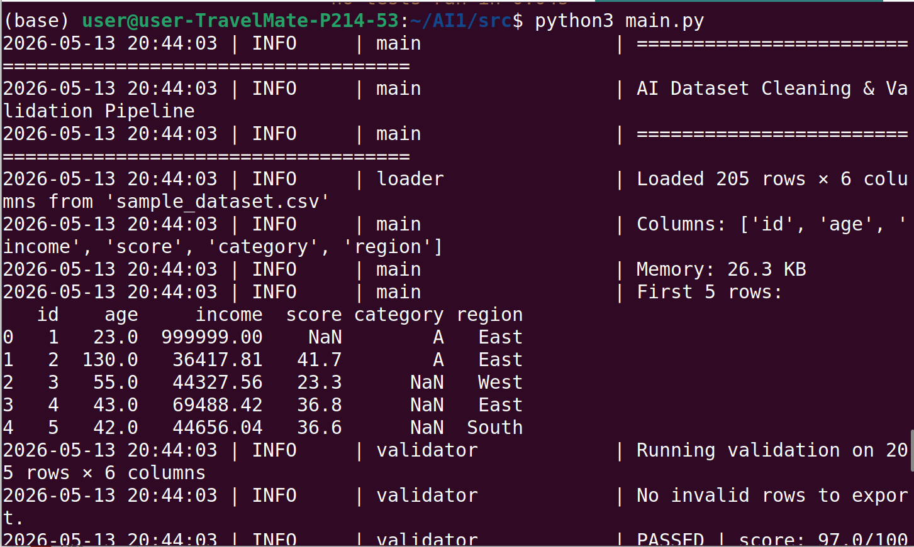
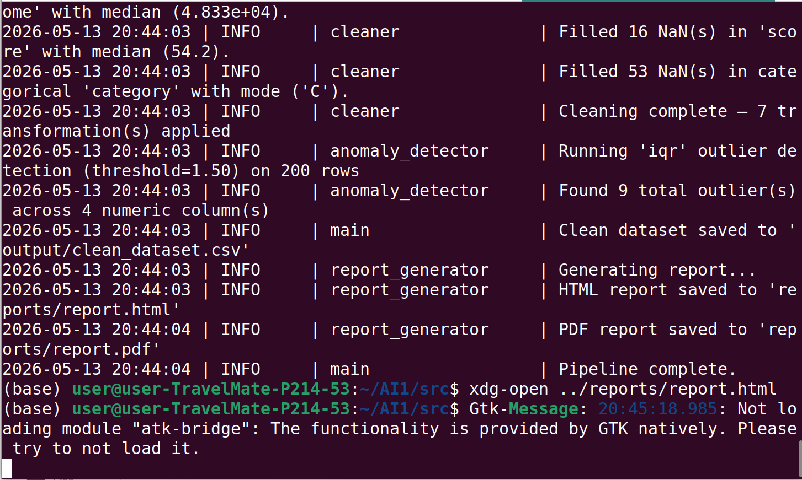
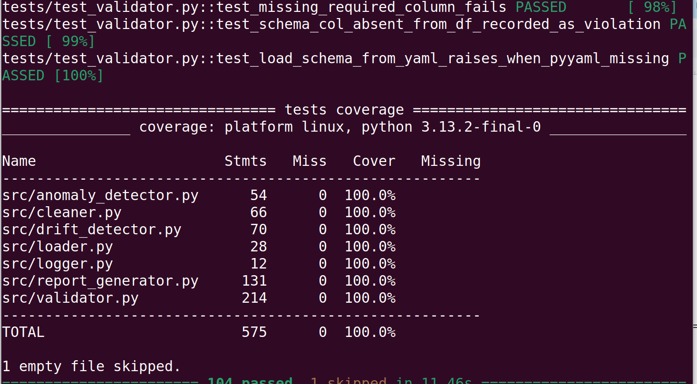
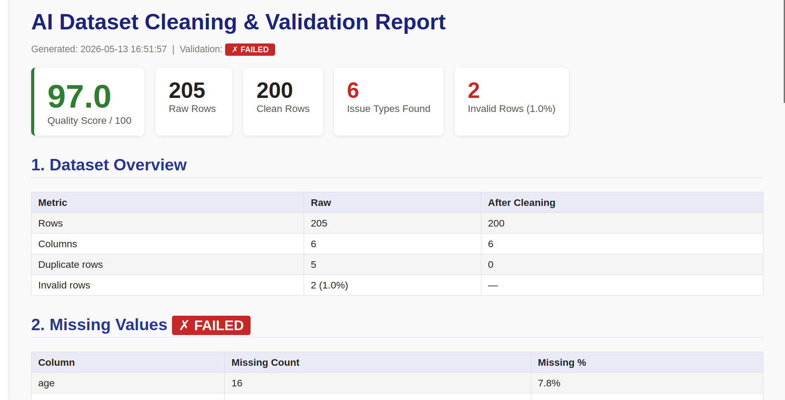
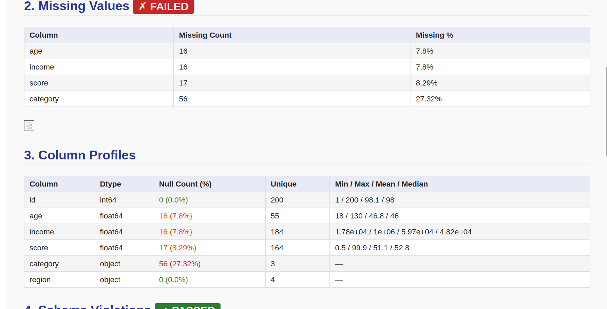
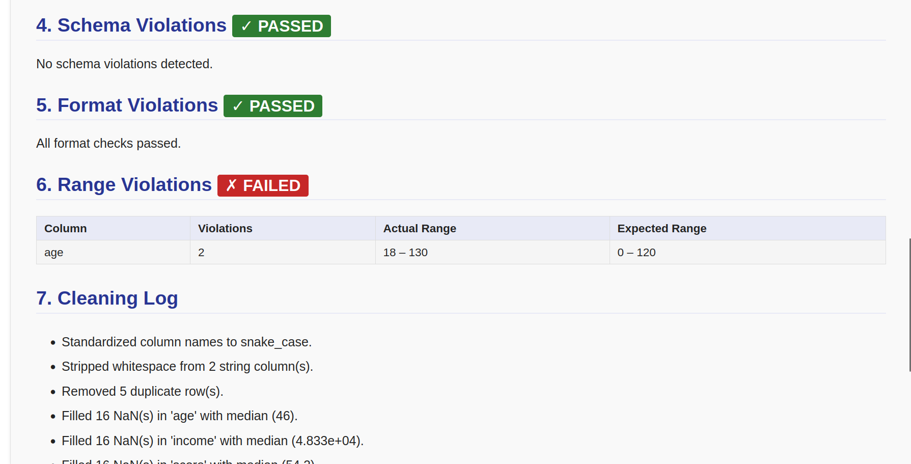
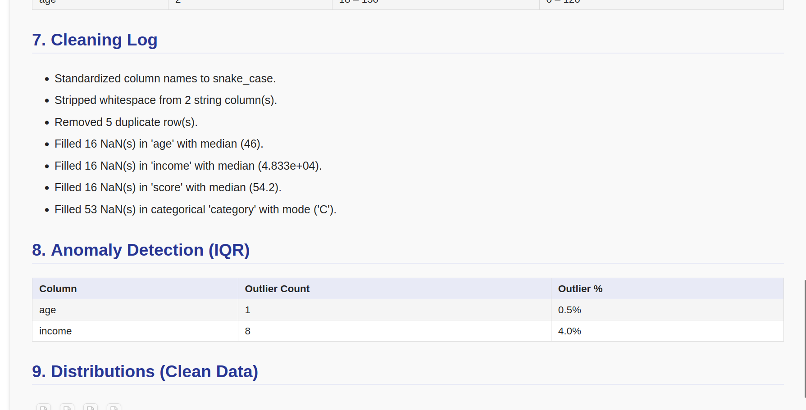

# AI Dataset Cleaning & Validation Pipeline

[](https://github.com/your-org/ai-dataset-pipeline/actions/workflows/ci.yml)
[](https://www.python.org/downloads/)
[](#testing)
[](#testing)
[](https://github.com/astral-sh/ruff)

A production-grade, modular data quality system for cleaning, validating, and profiling tabular datasets before they enter ML training pipelines or analytics workflows. The pipeline catches structural, semantic, and statistical problems early — before they silently corrupt downstream models.

---

## Table of Contents

- [Overview](#overview)
- [Features](#features)
- [Architecture](#architecture)
- [Pipeline Stages](#pipeline-stages)
- [Project Structure](#project-structure)
- [Installation](#installation)
- [Usage](#usage)
  - [Zero-configuration quickstart](#zero-configuration-quickstart)
  - [CLI reference](#cli-reference)
  - [Programmatic API](#programmatic-api)
  - [Schema configuration](#schema-configuration)
- [HTML Report](#html-report)
- [Drift Detection](#drift-detection)
- [Testing](#testing)
- [CI Pipeline](#ci-pipeline)
- [Roadmap](#roadmap)

---

## Overview

Real-world datasets are messy. Missing values, type mismatches, out-of-range numerics, malformed strings, duplicate rows, and statistical outliers are routine problems that compound silently — a model trained on corrupted data fails quietly, often long after the data issue was introduced.

This pipeline provides a systematic, auditable way to:

1. **Validate** a dataset against a declarative schema before any transformation
2. **Clean** it through a configurable, logged sequence of operations
3. **Detect** statistical anomalies with IQR or Z-score methods
4. **Detect drift** by comparing the incoming batch against a known-good baseline
5. **Report** every finding in a self-contained HTML quality report

Every stage returns structured results (dataclasses, not print statements), making the pipeline composable — you can run only the stages you need, or embed them in an existing orchestration framework.

---

## Features

### Data Validation
- **Schema-driven rules** — per-column dtype, nullable, numeric range, allowed values, and regex constraints defined in YAML or Python dicts
- **Regex validation** — built-in named patterns (`email`, `phone`, `zip_us`, `date_iso`) plus raw regex strings
- **Column profiling** — dtype, null rate, unique count, min/max/mean/median/std computed in one pass alongside validation
- **Data quality score** — a 0–100 composite score with proportional missing/duplicate penalties and flat per-column violation penalties
- **Invalid row export** — rows that failed at least one check written to a separate CSV for downstream triage

### Data Cleaning
- **Flexible imputation** — `median`, `mean`, `mode`, or `drop` strategies for missing numeric values; per-column custom fills
- **Duplicate removal** — exact-row deduplication with count logging
- **Column name standardisation** — strips whitespace and normalises to `snake_case`
- **String whitespace stripping** — trims leading/trailing whitespace in all object columns
- **Full audit log** — every transformation recorded as a timestamped message list

### Anomaly Detection
- **IQR method** — `Q1 − k·IQR / Q3 + k·IQR` fences (configurable multiplier `k`); robust to skewed distributions
- **Z-score method** — standard-deviation-based threshold; best for near-normal distributions
- **Non-destructive** — `detect()` flags outliers; `remove_outliers()` drops them — two separate operations

### Data Drift Detection
- **Kolmogorov–Smirnov test** (via `scipy`) — distribution-free significance test comparing two samples
- **Normalised mean shift** — `(new_mean − base_mean) / base_std` — how many standard deviations the mean moved
- **Std ratio** — `new_std / base_std` — whether the spread of the distribution changed
- **Graceful fallback** — mean/std thresholds used automatically when `scipy` is unavailable
- **Per-column drift flags** and an `overall_drift_score` (0–100, fraction of drifted columns)

### Reporting
- **Great Expectations-inspired HTML report** — quality scorecard, dataset overview, validation results, column profiles, schema/format/range violation tables, cleaning log, outlier summary, distribution histograms, optional drift section
- **Self-contained** — charts embedded as linked PNG files; no external CDN dependencies
- **Optional PDF export** — via `weasyprint` when installed

### Engineering Quality
- **Pandas 3.x compatible** — no chained assignment patterns; all mutations use explicit column reassignment
- **100% test coverage** — 104 tests across 6 test modules (1 skipped without `openpyxl`)
- **Full type annotations** — validated with `mypy --strict` (minus `warn_return_any`)
- **Ruff linting** — E, F, I, B, UP rules at line-length 100
- **Structured logging** — `logging` module throughout; no `print()` calls
- **5-stage CI** — syntax, FutureWarning import check, mypy, ruff, pytest

---

## Architecture

```
src/
├── main.py              ← CLI entry point (argparse) + pipeline orchestrator
├── loader.py            ← I/O: CSV / JSON / Excel → DataFrame
├── validator.py         ← Schema definition, profiling, validation, quality score
├── cleaner.py           ← Imputation, deduplication, column name normalisation
├── anomaly_detector.py  ← IQR and Z-score outlier detection
├── drift_detector.py    ← KS test + mean/std shift comparison
├── report_generator.py  ← HTML (+ optional PDF) quality report
└── logger.py            ← Centralised logging factory
```

Each module has a single responsibility and communicates through typed dataclasses — `ValidationResult`, `AnomalyReport`, `DriftReport` — rather than shared mutable state. This makes every stage independently testable and the pipeline composable.

```
               ┌──────────┐
               │  loader  │  load_csv / load_json / load_excel
               └────┬─────┘
                    │ df_raw
          ┌─────────▼──────────┐
          │     validator      │  schema rules + profiling + quality score
          └─────────┬──────────┘
                    │ ValidationResult
          ┌─────────▼──────────┐
          │      cleaner       │  impute + deduplicate + normalise columns
          └─────────┬──────────┘
                    │ df_clean + clean_log
          ┌─────────▼──────────┐
          │  anomaly_detector  │  IQR / Z-score outlier flags
          └─────────┬──────────┘
                    │ AnomalyReport
          ┌─────────▼──────────┐    ┌──────────────────┐
          │  report_generator  │◄───│  drift_detector  │ (optional)
          └─────────┬──────────┘    └──────────────────┘
                    │
               report.html
```

---

## Pipeline Stages

| # | Stage | Module | Input | Output |
|---|-------|--------|-------|--------|
| 1 | **Load** | `loader.py` | CSV / JSON / Excel path | `pd.DataFrame` |
| 2 | **Validate** | `validator.py` | Raw DataFrame + schema | `ValidationResult` (profiles, violations, score, invalid rows) |
| 3 | **Clean** | `cleaner.py` | Raw DataFrame | Cleaned `pd.DataFrame` + `list[str]` audit log |
| 4 | **Detect anomalies** | `anomaly_detector.py` | Cleaned DataFrame | `AnomalyReport` (per-column outlier counts + indices) |
| 5 | **Export** | `main.py` | Cleaned DataFrame | `output/clean_dataset.csv`, `output/invalid_rows.csv` |
| 6 | **Report** | `report_generator.py` | All of the above | `reports/report.html` (+ optional `report.pdf`) |

Drift detection is an optional seventh stage — run `DriftDetector.compare(baseline, incoming)` separately and pass the resulting `DriftReport` to `ReportGenerator.generate()`.

---

## Project Structure

```
ai-dataset-pipeline/
├── .github/
│   └── workflows/
│       └── ci.yml               # 5-stage GitHub Actions CI
├── config/
│   └── schema.yaml              # Column validation rules (YAML)
├── data/
│   └── sample_dataset.csv       # Auto-generated sample (200 rows)
├── output/                      # Created at runtime
│   ├── clean_dataset.csv
│   └── invalid_rows.csv
├── reports/                     # Created at runtime
│   ├── report.html
│   ├── missing_values.png
│   └── dist_*.png
├── src/
│   ├── main.py
│   ├── loader.py
│   ├── validator.py
│   ├── cleaner.py
│   ├── anomaly_detector.py
│   ├── drift_detector.py
│   ├── report_generator.py
│   └── logger.py
├── tests/
│   ├── conftest.py              # Shared fixtures (clean_df, dirty_df)
│   ├── test_loader.py
│   ├── test_validator.py
│   ├── test_cleaner.py
│   ├── test_anomaly_detector.py
│   ├── test_drift_detector.py
│   └── test_report_generator.py
├── .coveragerc
├── mypy.ini
├── pytest.ini
├── ruff.toml
├── requirements.txt
└── requirements-dev.txt
```

---

## Installation

**Requirements:** Python 3.11 or later.

```bash
# 1. Clone the repository
git clone https://github.com/your-org/ai-dataset-pipeline.git
cd ai-dataset-pipeline

# 2. Create and activate a virtual environment
python3 -m venv .venv
source .venv/bin/activate          # Windows: .venv\Scripts\activate

# 3. Install runtime dependencies
pip install -r requirements.txt

# 4. (Optional) Install development dependencies for testing and linting
pip install -r requirements-dev.txt
```

**Runtime dependencies** (`requirements.txt`):

| Package | Purpose |
|---------|---------|
| `pandas` | DataFrame operations throughout the pipeline |
| `numpy` | Numeric computations in anomaly and drift detection |
| `matplotlib` | Distribution histogram generation |
| `seaborn` | Missing-value bar chart |
| `scikit-learn` | Reserved for future ML-based anomaly detection |
| `pyyaml` | YAML schema loading |
| `scipy` | Kolmogorov–Smirnov test in drift detection |
| `weasyprint` | Optional PDF report export |

---

## Usage

### Zero-configuration quickstart

Run with no arguments. A 200-row synthetic dataset with injected quality issues is auto-generated in `data/`, and the full pipeline runs against it:

```bash
python3 src/main.py
```

Output:
- `output/clean_dataset.csv` — cleaned data
- `output/invalid_rows.csv` — rows that failed validation
- `reports/report.html` — full HTML quality report

---

### CLI reference

```
usage: main.py [-h] [--input FILE] [--schema FILE] [--output-dir DIR]
               [--report-dir DIR] [--anomaly-method {iqr,zscore}]

options:
  --input, -i FILE         Path to the input CSV file. A synthetic sample is
                           auto-generated when the file does not exist.
                           (default: data/sample_dataset.csv)
  --schema, -s FILE        Path to a YAML schema file that defines per-column
                           validation rules. Silently skipped when the file
                           does not exist.
                           (default: config/schema.yaml)
  --output-dir DIR         Directory for clean_dataset.csv and
                           invalid_rows.csv. (default: output)
  --report-dir DIR         Directory for report.html and optional PDF.
                           (default: reports)
  --anomaly-method         {iqr,zscore}  Outlier detection algorithm.
                           (default: iqr)
```

**CLI examples:**

```bash
# Run with a custom input file and schema
python3 src/main.py --input data/my_dataset.csv --schema config/schema.yaml

# Save outputs to a timestamped directory
python3 src/main.py --input data/jan_batch.csv \
    --output-dir runs/jan/ \
    --report-dir runs/jan/report/

# Use Z-score outlier detection (better for near-normal distributions)
python3 src/main.py --input data/transactions.csv --anomaly-method zscore

# Run validation only — skip schema by passing a non-existent file
python3 src/main.py --input data/raw.csv --schema /dev/null

# Short flags
python3 src/main.py -i data/raw.csv -s config/schema.yaml
```

---

### Programmatic API

Every component can be used independently. The pipeline is a set of composable functions, not a black box:

```python
from src.loader import load_csv
from src.validator import DataValidator, load_schema_from_yaml
from src.cleaner import DataCleaner
from src.anomaly_detector import AnomalyDetector
from src.drift_detector import DriftDetector
from src.report_generator import ReportGenerator

# Load
df_raw = load_csv("data/my_dataset.csv")

# Validate against a YAML schema
schema = load_schema_from_yaml("config/schema.yaml")
validator = DataValidator(schema=schema)
result = validator.run(df_raw, export_invalid_to="output/invalid_rows.csv")

print(f"Quality score: {result.quality_score}/100")
print(f"Missing values: {result.missing_summary}")
print(f"Schema violations: {result.schema_violations}")

# Clean
cleaner = DataCleaner(fill_strategy="median", drop_duplicate=True)
df_clean, log = cleaner.run(df_raw)

# Detect anomalies
detector = AnomalyDetector(method="iqr", threshold=1.5)
anomaly_report = detector.detect(df_clean)
print(f"Outliers found: {anomaly_report.total_outliers}")

# Compare against a baseline for drift
drift_detector = DriftDetector(ks_alpha=0.05, mean_shift_threshold=0.5)
drift_report = drift_detector.compare(df_baseline, df_clean)
print(f"Drifted columns: {drift_report.drifted_columns}")

# Generate the HTML report (with optional drift section)
reporter = ReportGenerator(output_dir="reports/")
reporter.generate(
    df_raw=df_raw,
    df_clean=df_clean,
    validation_result=result,
    anomaly_report=anomaly_report,
    clean_log=log,
    drift_report=drift_report,   # omit to skip the drift section
)
```

You can also call `run_pipeline()` directly with keyword arguments, overriding only the options you need:

```python
from src.main import run_pipeline

df_clean = run_pipeline(
    data_file="data/batch_42.csv",
    schema_file="config/production_schema.yaml",
    output_dir="runs/batch_42/output",
    report_dir="runs/batch_42/report",
    anomaly_method="zscore",
)
```

---

### Schema configuration

Column validation rules live in `config/schema.yaml`. Non-engineers can edit this file without touching Python source:

```yaml
schema:
  id:
    nullable: false             # NaN in this column is a hard failure

  age:
    dtype: float64
    nullable: true
    min: 0
    max: 120                    # 130 would be flagged as out-of-range

  email:
    dtype: object
    nullable: false
    regex: email                # built-in pattern: ^[a-zA-Z0-9._%+\-]+@...

  status:
    nullable: false
    allowed_values:             # any value outside this set is a violation
      - active
      - inactive

  phone:
    regex: phone                # built-in: +1-800-555-0100, (800) 555-0100, etc.

  order_date:
    regex: date_iso             # built-in: YYYY-MM-DD
    nullable: false
```

**Built-in regex patterns:**

| Key | Matches |
|-----|---------|
| `email` | `user@example.com` |
| `phone` | `+1-800-555-0100`, `(800) 555-0100`, `800.555.0100` |
| `zip_us` | `12345`, `12345-6789` |
| `date_iso` | `2024-01-31` |

Raw regex strings are also accepted: `regex: "^[A-Z]{2}[0-9]{4}$"`.

---

## HTML Report

The HTML report is generated after every pipeline run and saved to `reports/report.html`. It contains:

| Section | Content |
|---------|---------|
| **Quality Scorecard** | Colour-coded 0–100 score, raw/clean row counts, issue type count, invalid row count |
| **Dataset Overview** | Before/after row and column counts, duplicate count |
| **Missing Values** | Per-column missing count and percentage, bar chart |
| **Column Profiles** | dtype, null rate, unique count, min/max/mean/median for every column |
| **Schema Violations** | Allowed-value and nullable constraint violations by column |
| **Format Violations** | Regex check failures with invalid value samples |
| **Range Violations** | Out-of-range numeric values with actual vs expected range |
| **Cleaning Log** | Every transformation applied, in order |
| **Anomaly Detection** | Outlier count and percentage per numeric column |
| **Distributions** | Histogram + KDE for each numeric column in the cleaned dataset |
| **Data Drift** *(optional)* | Mean shift, std ratio, KS statistic/p-value, drift flag per column |

> **Screenshot placeholder**
>
> 
> *Quality scorecard: colour shifts from green (≥80) → amber (60–79) → red (<60)*
>
> 
> *Column profiles table with null-rate colour coding*
>
> 
> *Per-column distribution histograms generated from the cleaned dataset*

---

## Drift Detection

Data drift is the statistical change in a feature's distribution between two datasets — typically the training set (or last known-good batch) and a new incoming batch.

A model trained on one distribution degrades silently when the input distribution shifts: there is no exception, no log error, just quietly wrong predictions. Drift detection surfaces this problem before it reaches users.

### How it works

For each shared numeric column, `DriftDetector.compare(baseline, incoming)` computes three statistics:

```
mean_shift = (incoming_mean − baseline_mean) / baseline_std
```
Normalised mean shift: how many standard deviations the mean moved. Values with `|mean_shift| > 0.5` are typically significant.

```
std_ratio = incoming_std / baseline_std
```
Spread change: values outside `(1/threshold, threshold)` indicate the distribution has become tighter or wider.

```
KS statistic, p-value = ks_2samp(baseline_column, incoming_column)
```
The Kolmogorov–Smirnov test is distribution-free — it makes no assumptions about normality. A p-value below `ks_alpha` (default `0.05`) flags the column as drifted.

When `scipy` is not installed, the pipeline falls back automatically to mean-shift and std-ratio thresholds alone.

### Example

```python
from src.drift_detector import DriftDetector

detector = DriftDetector(
    ks_alpha=0.05,             # KS p-value threshold
    mean_shift_threshold=0.5,  # σ units (fallback only)
    std_ratio_threshold=2.0,   # ratio bounds (fallback only)
)

report = detector.compare(df_train, df_production)

print(f"Overall drift score: {report.overall_drift_score}/100")
print(f"Drifted columns: {report.drifted_columns}")

for col, result in report.column_results.items():
    print(f"  {col}: mean_shift={result.mean_shift}, ks_p={result.ks_p_value}, drifted={result.drifted}")
```

```
Overall drift score: 66.7/100
Drifted columns: ['income', 'age']

  age:    mean_shift=0.12,  ks_p=0.4821, drifted=False
  income: mean_shift=3.81,  ks_p=0.0001, drifted=True
  score:  mean_shift=-0.03, ks_p=0.9133, drifted=False
```

---

## Testing

The test suite uses `pytest` with `pytest-cov` for coverage reporting.

```bash
# Run all tests
pytest

# Run with coverage (shows missing lines)
pytest --cov=src --cov-report=term-missing

# Run a specific test module
pytest tests/test_validator.py -v

# Run tests matching a keyword
pytest -k "drift" -v
```

**Coverage summary (current):**

```
Name                      Stmts   Miss   Cover
----------------------------------------------
src/anomaly_detector.py      54      0   100%
src/cleaner.py               66      0   100%
src/drift_detector.py        70      0   100%
src/loader.py                28      0   100%
src/logger.py                12      0   100%
src/report_generator.py     131      0   100%
src/validator.py            214      0   100%
----------------------------------------------
TOTAL                       575      0   100%
```

**Test modules:**

| Module | Tests | Covers |
|--------|-------|--------|
| `test_loader.py` | 11 | CSV/JSON/Excel loading, `get_basic_info`, error paths |
| `test_validator.py` | 37 | Schema, profiling, regex, quality score, YAML loading, export |
| `test_cleaner.py` | 16 | All fill strategies, deduplication, column normalisation, immutability |
| `test_anomaly_detector.py` | 12 | IQR, Z-score, `remove_outliers`, edge cases |
| `test_drift_detector.py` | 11 | KS test, no-scipy fallback, early return, score calculation |
| `test_report_generator.py` | 18 | HTML sections, charts, drift rendering, PDF exception handling |

---

## CI Pipeline

Every push and pull request to `main` runs a 5-stage quality gate defined in `.github/workflows/ci.yml`:

```
┌──────────────────────────┐
│  1. Syntax check         │  py_compile — catches parse errors before anything runs
├──────────────────────────┤
│  2. FutureWarning check  │  imports all modules with -W error::FutureWarning
│                          │  ensures pandas 3.x compatibility
├──────────────────────────┤
│  3. Type checking        │  mypy src/ — enforces type annotations
├──────────────────────────┤
│  4. Linting              │  ruff check — E, F, I, B, UP rules at line-length 100
├──────────────────────────┤
│  5. Test suite           │  pytest -q with MPLBACKEND=Agg for headless chart generation
└──────────────────────────┘
```

The CI file: `.github/workflows/ci.yml`. All stages must pass before a PR can be merged.

---

## Roadmap

Planned enhancements in rough priority order:

- [ ] **Incremental validation** — validate only new rows in an append-only dataset without re-scanning the full history
- [ ] **ML-based anomaly detection** — Isolation Forest and Local Outlier Factor (scikit-learn already a dependency)
- [ ] **Streaming support** — process large files in chunks via `pd.read_csv(chunksize=...)` without loading the full dataset into memory
- [ ] **Great Expectations integration** — export `ValidationResult` as a native GE `ExpectationSuite` for compatibility with existing GE checkpoints
- [ ] **Pluggable loaders** — Parquet, Avro, Delta Lake, and database connector support via a loader registry
- [ ] **Schema inference** — automatically suggest a schema YAML from a sample of clean data
- [ ] **Drift alerting** — webhook or email notification when `overall_drift_score` exceeds a configurable threshold
- [ ] **Interactive report** — replace static PNGs with Plotly/Altair charts embedded directly in the HTML
- [ ] **REST API** — FastAPI wrapper so the pipeline can be called as a microservice from orchestrators (Airflow, Prefect, Dagster)
- [ ] **Docker image** — single-container deployment with a pre-built environment

---

## Contributing

1. Fork the repository and create a feature branch: `git checkout -b feature/your-feature`
2. Install dev dependencies: `pip install -r requirements-dev.txt`
3. Make your changes, add tests, ensure coverage does not drop
4. Run the full quality gate locally:

```bash
ruff check .
mypy src/
pytest --cov=src --cov-report=term-missing
```

5. Open a pull request — CI runs automatically on push

---
## Pipeline Output




## Test Coverage



## HTML Report





---

## License

MIT License. See [LICENSE](LICENSE) for details.
